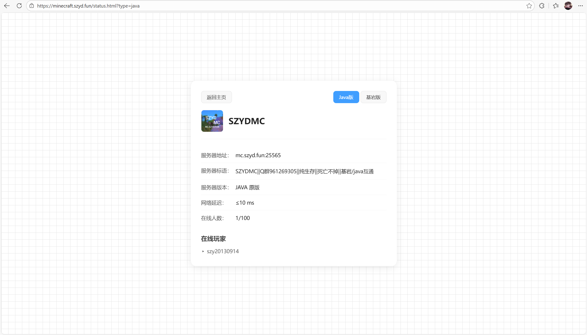

# MCServerStatusWebPanel

由SZY创新工作室开发的纯静态打造的MCJava/基岩/互通服务器状态网页面板

预览地址：[https://minecraft.szyd.fun/status.html](https://minecraft.szyd.fun/status.html)

## 特点

- 支持单基岩/单Java/互通服务器三种版本
- 调用 Minecraft Server Status API（https://api.mcsrvstat.us）进行服务器数据抓取，安全稳定
- 使用CSS白底黑网格背景，简约美观。
- 支持自定义服务器名称与头像
- 支持查询服务器标语、服务器版本、网络延迟、在线人数、在线玩家

## 安装方法

### 文件结构

```
MCServerStatusWebPanel
├─ JAVA
│  ├─ config.json（服务器名称、地址）
│  ├─ favicon.png（服务器头像）
│  ├─ script.js（接口调用、动画JS）
│  ├─ status.html（主页面）
│  └─ style.css（CSS）
├─ Bedrock
│  ├─ config.json
│  ├─ favicon.png
│  ├─ script.js
│  ├─ status.html
│  └─ style.css
└─ All
   ├─ config.json
   ├─ favicon.png
   ├─ script.js
   ├─ status.html
   └─ style.css
```

### 详细教程

1. 从Releases下载合适的版本（JAVA/Bedrock/All）
2. 将下载好的压缩包解压至网站目录
3. 修改`config.json`为你的服务器名称和地址
4. 修改`status.html`的网页标题
5. 将`favicon.png`替换为你的服务器实际头像
6. 如果你希望将这个页面作为你的网站主页，将`status.html`改为`index.html`并删除有关`action-bar`的所有内容
7. 查看部署效果

### 预览图



> 图为互通服版本

